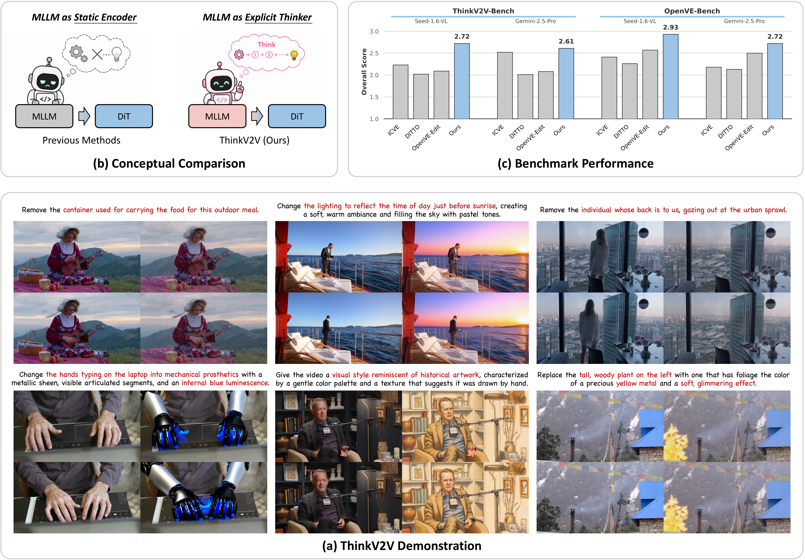

# ThinkV2V: Unleashing the Reasoning Capability of MLLMs for Instruction-Guided Video Editing

<div>
  <a href="https://github.com/Correr-Zhou/ThinkV2V"></a> &ensp;
  <a href="https://correr-zhou.github.io/ThinkV2V"></a> &ensp;
  <a href="https://huggingface.co/donghao-zhou/ThinkV2V-5B"></a> &ensp;
  <a href="https://huggingface.co/datasets/donghao-zhou/ThinkV2V-150K"></a> &ensp;
  <a href="https://huggingface.co/datasets/donghao-zhou/ThinkV2V-Bench"></a>
</div>

---

ThinkV2V is a reasoning-driven framework for complex instruction-guided video editing. Instead of using a multimodal large language model only as a semantic encoder, ThinkV2V explicitly activates MLLM thinking over the source video and user instruction, converts the reasoning result into refined conditioning signals, and injects them into a DiT video editor. The framework also combines Progressive Curriculum Learning that moves from stable basic editing to reasoning-intensive cases with Inference-Time Thinking Scaling, where the MLLM refines candidate editing plans and selects the most reliable one before generation.

<div align="center">
  
</div>

## 🛠️ Environment Setup

Create a clean Python environment from the cloned repository root and install the package dependencies:

```bash
git clone https://github.com/Correr-Zhou/ThinkV2V.git
cd ThinkV2V

conda create -n thinkv2v python=3.10 -y
conda activate thinkv2v

pip install -r requirements.txt
pip install -e .
```

The code is tested with Python 3.10, CUDA 12.x, PyTorch 2.6.0, and multi-GPU execution through `torchrun` and `accelerate`.

If the default PyTorch installation does not match your CUDA version, reinstall PyTorch manually. For example, for CUDA 12.4:

```bash
pip install --index-url https://download.pytorch.org/whl/cu124 \
  torch==2.6.0 torchvision==0.21.0
```

## 📦 Data, Benchmark, and Checkpoint

The default scripts expect all assets inside the cloned repository:

```text
ThinkV2V/
  data/
    OpenVE-HQ-1M/
    ThinkV2V-150K/
    ThinkV2V-Bench/
  weights/
    Lucy-Edit-Dev/
    Qwen3-VL-8B-Thinking/
    ThinkV2V/
    Wan2.2-TI2V-5B/
```

Download the required model weights, training metadata, and benchmark metadata:

```bash
bash download_weights.sh
bash download_data.sh
```

The released ThinkV2V checkpoint is expected at:

```text
weights/ThinkV2V/thinkv2v_5b.safetensors
```

`OpenVE-HQ-1M` and `ThinkV2V-150K` are metadata releases. `download_data.sh` does not download the [OpenVE-3M](https://huggingface.co/datasets/Lewandofski/OpenVE-3M) video files. For training, download the OpenVE-3M videos separately.

## 🚀 Training

Set the OpenVE-3M video root before launching training scripts:

```bash
export OPENVE3M_VIDEO_ROOT=/path/to/OpenVE-3M/videos
```

Continue training from the released ThinkV2V-5B checkpoint:

```bash
TRAIN_DATASET=thinkv2v \
bash run_train/train_from_checkpoint.sh
```

Use `TRAIN_DATASET=openve_hq` to continue on OpenVE-HQ-1M metadata instead:

```bash
TRAIN_DATASET=openve_hq \
bash run_train/train_from_checkpoint.sh
```

For full three-stage training, launch the stages in order. Stage 1 and stage 2 use OpenVE-HQ-1M metadata, and stage 3 continues on ThinkV2V-150K metadata:

```bash
bash run_train/train_stage1.sh

STAGE1_CKPT=/path/to/stage1_checkpoint.safetensors \
bash run_train/train_stage2.sh

STAGE2_CKPT=/path/to/stage2_checkpoint.safetensors \
bash run_train/train_stage3.sh
```

The training scripts use `accelerate launch` with `run_train/accelerate_config.yaml`. Override `NUM_GPUS` and `OUTPUT_ROOT` as needed; pass stage checkpoints through `STAGE1_CKPT` and `STAGE2_CKPT`.

## 🎬 Inference

Run benchmark inference with the released checkpoint:

```bash
BENCHMARK_CSV=data/ThinkV2V-Bench/benchmark_videos.csv \
VIDEO_ROOT=data/ThinkV2V-Bench \
MODEL_CKPT=/path/to/model_checkpoint.safetensors \
OUTPUT_DIR=outputs/infer/thinkv2v \
bash run_infer/infer_thinkv2v.sh
```

By default, the script uses 8 GPUs at 720p. Set `NUM_GPUS` or `RESOLUTION` only when using a different GPU count or resolution.

The generated videos are saved under `OUTPUT_DIR`, and the result CSV is written to:

```text
<OUTPUT_DIR>/infer_results.csv
```

The result CSV contains `edited_result_path`, which is used by the evaluation scripts. To enable inference-time thinking scaling, run the script with `ENABLE_THINKING_SCALING=1`.

## 📊 Evaluation

ThinkV2V-Bench follows the [OpenVE-Bench](https://github.com/OpenVE-Team/OpenVE-3M) metadata style. We provide three evaluators for the inference result CSV: Gemini, InternVL, and Qwen3-VL.

Gemini evaluation uses an OpenAI-compatible Chat Completions endpoint:

```bash
GEMINI_API_URL=<your-openai-compatible-chat-completions-url> \
GEMINI_API_KEY=<your-api-key> \
GEMINI_MODEL=gemini-2.5-pro \
python run_eval/gemini_benchmark.py \
  --input_csv outputs/infer/thinkv2v/infer_results.csv \
  --root_path data/ThinkV2V-Bench \
  --output_csv outputs/eval/gemini_scores.csv
```

`GEMINI_API_URL` should be a full endpoint ending with `/chat/completions`.

Local VLM evaluators require the corresponding evaluator checkpoints:

```bash
python run_eval/internvl_benchmark.py \
  --input_csv outputs/infer/thinkv2v/infer_results.csv \
  --root_path data/ThinkV2V-Bench \
  --output_csv outputs/eval/internvl_scores.csv \
  --model_path /path/to/InternVL3_5-38B

python run_eval/qwen3vl_benchmark.py \
  --input_csv outputs/infer/thinkv2v/infer_results.csv \
  --root_path data/ThinkV2V-Bench \
  --output_csv outputs/eval/qwen3vl_scores.csv \
  --model_path /path/to/Qwen3-VL-32B-Instruct
```

Each evaluator writes per-sample scores to `--output_csv` and a summary JSON next to it.

## 🤝 Acknowledgements

ThinkV2V builds on open research and tooling from [DiffSynth-Studio](https://github.com/modelscope/DiffSynth-Studio), [Wan](https://github.com/Wan-Video/Wan2.1), [Lucy-Edit](https://huggingface.co/decart-ai/Lucy-Edit-Dev), and [OpenVE](https://github.com/OpenVE-Team/OpenVE-3M).

## 🔗 Citation

If ThinkV2V is helpful for your research or projects, please consider citing our work:

```bibtex
@article{zhou2026thinkv2v,
  title={ThinkV2V: Unleashing the Reasoning Capability of MLLMs for Instruction-Guided Video Editing},
  author={Zhou, Donghao and He, Haoyang and Zhang, Fan and Yang, Hao and Liu, Guisheng and Gao, Xin and Wan, Zhongwei and Bu, Xingyuan and Wang, Jie and Yang, Qiangpeng and Wen, Shilei and Fu, Chi-Wing and Heng, Pheng-Ann},
  journal={arXiv preprint},
  year={2026}
}
```

## 📬 Contact

For questions about ThinkV2V, please contact Donghao Zhou at [dhzhou@link.cuhk.edu.hk](mailto:dhzhou@link.cuhk.edu.hk).
